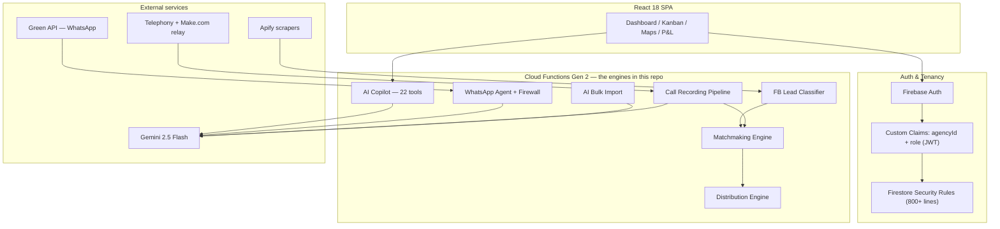

# hOMER — Real-Estate AI Engines


Production engines extracted from **hOMER** — a multi-tenant SaaS CRM for Israeli real-estate agencies (React 18 + Firebase + Gemini) that I designed and built end-to-end. Each module here is a self-contained piece of the live system, adapted to run standalone: secrets via env, demo data instead of tenant Firestore, and a README explaining the engineering decisions.

> Hebrew appears throughout the prompts and demo data — the product serves the Israeli market, and handling Hebrew (RTL, word-form numerals, mixed-language posts) is part of the engineering.

## Modules

| Module | What it is | Runs standalone |
|---|---|---|
| [matchmaking](src/matchmaking/) | Weighted property↔lead scoring (0–100): strict gates, budget linear degradation, rooms tolerance, location sub-scoring, `requiresVerification` flags | ✅ no API key |
| [ai-copilot](src/ai-copilot/) | Gemini function-calling agent with 22 CRM tools, RBAC enforced inside the executors, serving both the dashboard chat and an internal WhatsApp bot | ✅ Gemini key |
| [whatsapp-agent](src/whatsapp-agent/) | Customer-facing WhatsApp bot: hybrid state machine + Gemini tools, injection-hardened dynamic prompt, layered security pipeline, AI firewall (auto-mute / human handoff) | partially |
| [distribution](src/distribution/) | Concurrency-safe round-robin lead/property assignment inside Firestore transactions, specialization + service-area filtering | Firebase project |
| [lead-classifier](src/lead-classifier/) | Hebrew Facebook-post classification (SELLER/BUYER) — deterministic heuristics first, Gemini text/Vision as fallback for anomalies and image-only posts | ✅ no API key |
| [data-extractor](src/data-extractor/) | One Gemini function importing 7 entity types from CSV / free text / photos, strict JSON contracts per type | ✅ Gemini key |
| [call-pipeline](src/call-pipeline/) | Call recording → transcription → structured lead, via a static-IP relay that bypasses the telephony provider's IP whitelist | Firebase project |

A companion repo, [homer-airflow-etl](https://github.com/omerdigitalsolutions-collab/homer-airflow-etl), covers the data-engineering side: an Apache Airflow DAG (scrape → normalize → validate → dedup → fan-out to Firestore + BigQuery) with pytest coverage.

## Quick start

```bash
npm install
npm run build                  # typecheck everything

npm run demo:matchmaking       # scoring engine — no API key needed
npm run demo:classifier        # Hebrew post classifier — no API key needed
GEMINI_API_KEY=... npm run demo:copilot   # full agent loop with tool-call trace
```

## Architecture (full system)



## Engineering highlights

**Race condition in resource allocation.** Parallel incoming leads could double-book the same agent. Fixed by running the whole round-robin read→pick→write cycle inside a Firestore transaction — fairness guaranteed by ACID, not by luck. ([distribution](src/distribution/))

**Vendor IP whitelist vs. dynamic egress IPs.** The telephony provider only serves recordings to whitelisted IPs; Cloud Functions don't have one. Solved with a static-IP relay (Make.com) and a hardened ingest endpoint: constant-time secret comparison, tenancy derived from our own routing docs rather than the request body, storage-path pinning against IDOR, full idempotency across provider retries. ([call-pipeline](src/call-pipeline/))

**LLMs inside deterministic business logic.** Heuristics first, model as fallback, every model output validated like untrusted input, and uncertainty surfaced as `requiresVerification` flags for a human instead of fabricated confidence. ([lead-classifier](src/lead-classifier/), [matchmaking](src/matchmaking/), [call-pipeline](src/call-pipeline/))

**Permissions live in the tool layer, not the prompt.** The copilot's executors receive `{uid, role}` and enforce RBAC themselves — a prompt-injected "show me everyone's commissions" gets an error object, because the model was never the security boundary. ([ai-copilot](src/ai-copilot/))

**A bot that knows when to shut up.** Outbound message from a human agent → bot auto-mutes for that customer. Customer asks for a human → polite handoff, bot off, push notification to the agent. Plus a pre-LLM security pipeline: rate limiting at two scopes, Hebrew+English injection detection with cumulative auto-block, and rolling session TTLs. ([whatsapp-agent](src/whatsapp-agent/))

## About the production system

The full product is closed-source. It serves multiple agencies with complete tenant isolation (`agencyId` as a server-set JWT custom claim + Firestore rules), Stripe billing, Google Calendar OAuth sync, scheduled Apify scraping with an 80% cloud-cost optimization (activity-gated city sync + today-only temporal windows), and a draggable KPI/P&L dashboard. Happy to walk through any of it in an interview.

## License

MIT
