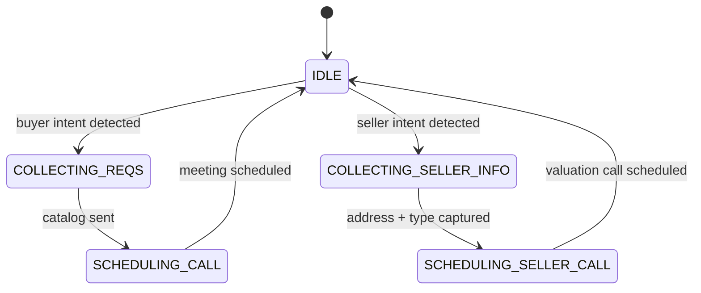

# WhatsApp AI Agent — Customer Bot with a Security Firewall

The customer-facing WhatsApp bot ("WeBot") that answers buyers and sellers over Green API, qualifies them, sends a personalized property catalog, and books a consultation call — while a layered security pipeline keeps prompt injection, floods and stale sessions away from the LLM.

## Architecture

```
Green API webhook
      ▼
┌─ Security pipeline (pipeline.ts) ─────────────────────────┐
│ blocklist → rate limit → sanitize → opt-out → injection   │
│ detection (score ≥ 3 auto-blocks) → 24h session TTL       │
└────────────────────────────────────────────────────────────┘
      ▼
State machine + Gemini function calling (botTools.ts)
      ▼
Green API reply
```

### The hybrid state machine

A persisted state machine drives the macro funnel; Gemini function calling makes the micro decisions inside each stage:



Intent (buyer vs. seller vs. irrelevant) is classified by Gemini with example-based prompting — keyword shortcuts were removed after producing false positives in Hebrew. State lives on the lead document with a `lastStateAt` timestamp and a 24h inactivity TTL.

The bot exposes 6 tools to Gemini (`botTools.ts`): `update_lead_requirements`, `create_catalog`, `check_availability`, `schedule_meeting`, `search_property_by_location`, and `notify_assigned_agent` (pings the responsible agent when a customer asks about an exclusive listing).

### The dynamic system prompt (promptBuilder.ts)

`buildWeBotPrompt()` rebuilds the prompt per message from live data:

- **Agency personality** — tone (professional / friendly / direct-sales / custom), fallback behavior, and free-text guardrails, all configured by the agency admin in the dashboard.
- **RAG-lite context** — the agency's top active properties injected as a structured list, so the bot answers price/rooms/floor questions from real inventory and never invents listings.
- **Injection-hardened embedding** — every admin- or listing-supplied string is sanitized before embedding (newlines stripped, `===`/`---` collapsed, length-capped), so a malicious property description can't open a fake "=== new instructions ===" section inside the prompt.

### The security pipeline (pipeline.ts + security/)

| Layer | Behavior |
|---|---|
| Blocklist | Known-bad phones dropped silently |
| Rate limit | 10 msgs/min per phone **and** 500/hour per agency — the second window defeats phone-rotation floods. Production runs both counters in Firestore transactions |
| Sanitize | Control chars stripped, whitespace collapsed, 500-char cap |
| Opt-out | Hebrew/English keywords → confirmation + permanent follow-up opt-out |
| Injection detection | Regex patterns (English + Hebrew). Score accumulates per phone across messages; ≥ 3 auto-blocks. Suspicious text is **never** forwarded to Gemini |
| Session TTL | Rolling 24h window — sliding with each message, not fixed from creation |
| Audit log | Every inbound/outbound/blocked event recorded (append-only in production) |

A deliberate decision: blocklist and rate-limit checks are **fail-safe** — if the check itself throws, the message passes. An infrastructure hiccup degrades the security layer instead of silencing the product.

## The AI Firewall (Auto-Mute + Human Handoff)

Bots that keep answering while a human agent has joined the conversation are embarrassing. Two mechanisms prevent that:

- **Auto-Mute** — when an outbound message authored by a human agent is detected (sent from the office phone or the CRM), the bot mutes itself for that customer immediately.
- **Human handoff** — when Gemini detects the customer wants a human ("תעביר אותי לנציג", anger, repeated frustration), it responds politely, disables itself, and pushes an urgent notification to the assigned agent.

A manual "Unmute bot" override in the CRM re-activates it.

## What was adapted for this repo

Firestore session/audit/lead writes are injected via the `PipelineDeps` interface; the 1,800-line production state-machine handler is represented here by its states, tool declarations and prompt builder. Green API credentials are stored AES-256-CBC-encrypted per agency in production and decrypted on the fly.

## Performance & data structures

**Security pipeline — fail-fast sequential O(1)–O(n) chain.** Each layer is evaluated in order; the first rejection exits immediately without evaluating later layers. Blocklist lookup is O(1) (Map/Set). Rate-limit checks are two Firestore reads (per-phone counter + per-agency counter) executed in parallel via `Promise.all`. Injection detection scans the sanitized message once with a pre-compiled regex, O(n) on message length (n ≤ 500 chars after the sanitization cap). Total pipeline overhead for a blocked message is dominated by the two Firestore reads, not computation.

**Suspicion score — cumulative counter, not a per-message binary.** Each injection-pattern hit increments a per-phone score stored in Firestore. Auto-block triggers at ≥ 3. This means a phone that sends borderline messages across several interactions accumulates to a block, while a single unusual word never does. The counter is a single integer field — O(1) read and atomic increment.

**Session state — flat document on the lead record.** `StoredChatState` is a plain object (`state`, `lastStateAt`, optional `pendingSellerAddress`, `pendingIntent`) merged into the lead document. Flat document = one Firestore read to load full session context, no subcollections, no joins.

**Prompt rebuilding — O(P) per message**, where P is the number of properties injected for RAG. Properties are fetched with a single `limit(20)` query on the agency's active-property collection, sorted by `updatedAt` descending. Each property contributes ~100 characters to the prompt. The total prompt is assembled with a single `Array.join` — no incremental string concatenation (avoids O(P²) string-copy behaviour).

**Tool declarations — 6 static `FunctionDeclaration` objects**, module-level constants shared across all bot invocations. Same pattern as the copilot: one allocation at module load, zero per-call allocation.

**Rate-limit counters — two independent windows.** Per-phone: 10 messages per minute (short window, catches single-phone floods). Per-agency: 500 messages per hour (wide window, catches phone-rotation DDoS). Both counters are integers in Firestore, incremented with `FieldValue.increment()` inside a transaction — O(1), atomic, no read-modify-write race.

**24h session TTL — `lastStateAt` timestamp field.** No scheduled job, no separate TTL collection. The pipeline checks `Date.now() - lastStateAt > 86_400_000` on every inbound message; an expired session is deleted inline (one Firestore delete) before processing continues. This is O(1) and eliminates the need for a cleanup cron.
